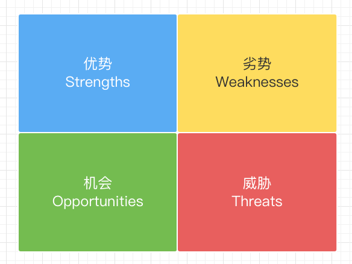

# 常用分析工具

### SWOT矩阵

### PDCA循环法则

### 6W2H

### SMART原则

重要

### 重要紧急原则

### OKR目标管理

> 1. [SMART goals are at the heart of a successful organisation](https://blog.v-comply.com/smart-goals-for-business/)
> 2. [How to Write Company OKRs for Effective Goal-Setting?](https://www.ntaskmanager.com/blog/okr-examples)

